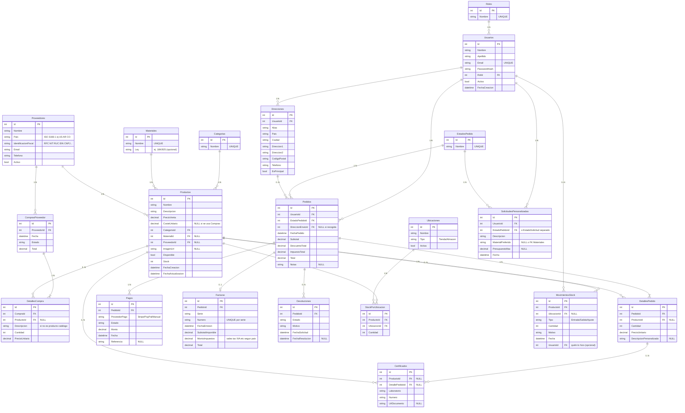

# Plan maestro del proyecto — Joyería MARR (FUENTE DE VERDAD)

Este documento consolida **todas** las decisiones, reglas y funcionalidades para llevar Joyería MARR a un nivel **completo y profesional** (no solo MVP).

**A partir de ahora, cualquier observación/cambio se discute y se refleja aquí.**  
Los demás `.md` quedan como material de referencia (y pueden integrarse/eliminarse más adelante).

---

## 1. Objetivo del producto (visión)

### 1.1 Qué vendemos
- Catálogo de joyería con fichas completas (materiales, medidas, fotos, stock, disponibilidad, certificados si aplica).
- Venta estándar (carrito + checkout) y **pedido personalizado** (a medida).
- Operación de tienda: administración de productos, pedidos, clientes, inventario y reportes.

### 1.2 Roles del sistema
- **Admin**: gestiona todo (catálogo, usuarios, pedidos, reportes, configuración).
- **Empleado**: gestiona catálogo y pedidos (según permisos).
- **Cliente**: compra, consulta, solicita personalizado, revisa historial.

### 1.3 Mercado objetivo (prioridad)
El producto se orienta **prioritariamente a Sudamérica y Estados Unidos** (idioma, datos fiscales e impuestos).

- **Identificación fiscal (proveedores y clientes B2B):** no usar términos solo de un país (p. ej. “NIF” español). En modelo de datos usar **`Pais`** (código ISO, ej. `US`, `AR`, `CO`, `MX`, `CL`, `PE`) + **`IdentificacionFiscal`** (texto) o campos equivalentes (`TaxId`). El significado concreto depende del país (ejemplos):
  - **EE. UU.:** EIN (empresa), a veces SSN/ITIN en contextos específicos (evitar almacenar datos sensibles sin necesidad).
  - **México:** RFC.
  - **Colombia:** NIT.
  - **Perú:** RUC.
  - **Argentina:** CUIT/CUIL.
  - **Chile:** RUT.
  - **Brasil:** CNPJ (empresa) / CPF (persona).
- **Impuestos en facturación:** no asumir solo “IVA”. Usar términos neutros: **subtotal imponible**, **monto total de impuestos**, **total**; el desglose (IVA, sales tax estatal, GST, etc.) se define por **jurisdicción** y reglas de negocio cuando implementéis facturación real.
- **Moneda y formato:** preparar para **multi-moneda** o al menos parametrizar moneda principal (`USD`, moneda local por país) en configuración.

---

## 2. Arquitectura (alto nivel)

- **Backend**: ASP.NET Core API + EF Core + SQL Server.
  - JWT (roles en claims).
  - Swagger.
  - Cloudinary para imágenes.
  - Migraciones EF Core.
  - Seed de datos para pruebas.
- **Frontend**: React SPA + React Router + Tailwind.
  - Modo claro/oscuro con persistencia (localStorage).
  - Páginas públicas + área admin.

---

## 3. Seguridad (repositorio público y operación)

### 3.1 Reglas mínimas
- **Nunca** subir secretos (`appsettings.json`, `.env`, keys Cloudinary/JWT/DB).
- Usar `appsettings.Example.json`, `.env.example`, User Secrets en desarrollo.
- Rotación de credenciales si hubo exposición.

### 3.2 Reglas de auth
- Passwords: hash con BCrypt.
- JWT: expiración, issuer/audience, clave fuerte.
- Endpoints sensibles: `[Authorize]` por rol.

---

## 4. Reglas de UI/UX (identidad visual)

Este proyecto tiene una identidad “lujo minimalista”.

- Paleta, layout, tipografías, animaciones y convenciones:
  - Paleta: claro (ivory/porcelain + oro) / oscuro (night + oro).
  - Contenedores: `max-w-5xl mx-auto`, `px-6 md:px-8`, secciones `py-16`.
  - Botón primario: `bg-gold-500 hover:bg-gold-600 text-white` + transiciones suaves.
  - Animaciones: reveal al scroll y microinteracciones, respetando `prefers-reduced-motion`.
- Tema:
  - Persistencia en `localStorage` con clave `darkMode`.
  - **Tema por defecto: claro**.
- Navegación interna:
  - Usar siempre `<Link>` (evitar `<a href>` internos).

---

## 5. Base de datos (modelo normalizado y ampliaciones “completo”)

### 5.1 Estado actual (normalizado, ya implementado)
Ya normalizado:
- **Roles** → Usuarios
- **Categorias** → Productos
- **EstadosPedido** → Pedidos

Además:
- `DetallePedido.ProductoId` es nullable (permite líneas personalizadas).
- Se recomienda soft delete en catálogo usando `Disponible` (y auditoría con timestamps).

### 5.2 Lo que falta para un negocio completo (no MVP)

#### 5.2.1 Proveedores y coste (margen)
Necesitamos saber:
- **De dónde** vienen las joyas (proveedor).
- **A qué coste** se compran (coste unitario o por compra).

Modelo recomendado (completo):
- **Proveedores**
- **ComprasProveedor** (cabecera)
- **DetalleCompra** (líneas)
- En producto:
  - `ProveedorId` (opcional: proveedor principal)
  - `CosteUnitario` (opcional, si no se usa compra por líneas)

#### 5.2.2 Material como tabla (normalización)
Material no debe ser texto libre.
- **Materiales** (tabla de referencia)
- `Productos.MaterialId` (FK nullable)

#### 5.2.3 Inventario profesional
Cuando aplique:
- **Ubicaciones** (tienda/almacén)
- **StockPorUbicacion** (ProductoId, UbicacionId, Cantidad)
- **MovimientosStock** (auditoría)
- **Lotes** (si se requiere trazabilidad por compra/lote)

#### 5.2.4 Facturación y devoluciones
- **Facturas** vinculadas a Pedidos (numeración, **impuestos** desglosados según jurisdicción, totales).
- **Devoluciones** (motivo, estado, reembolso/cambio) vinculadas a Pedido/Detalle.

#### 5.2.5 Certificados y garantía
- Certificados (diamantes/piedras): número, laboratorio, documento.
- Garantía por producto y/o por venta.

### 5.3 Diagrama ER objetivo (completo) — visión de largo plazo

Este diagrama representa el **modelo objetivo** para operar una joyería profesional. No implica implementarlo todo de golpe; sirve para ver el “mapa completo”.

### 5.4 Notas de diseño (para evitar retrabajo)
- **Materiales como tabla**: evita strings inconsistentes y habilita filtros reales.
- **Compras a proveedor**: permite coste por operación/lote (mejor que un único coste fijo en producto).
- **Stock**: cuando haya varias ubicaciones o auditoría, usar movimientos.
- **Facturación / impuestos**: separar **subtotal imponible**, **monto total de impuestos** y **total**; el tipo de impuesto y tasas dependen del país/estado (EE. UU. y Sudamérica).
- **Soft delete**: preferir desactivar (`Disponible`/`Activo`) antes que borrar.

### 5.5 Normalización (1FN–3FN) y desnormalización documentada

- **1FN:** atributos atómicos; catálogos en tablas propias (roles, categorías, materiales, estados); sin listas repetidas dentro de una columna.
- **2FN / 3FN (en la práctica):** con **PK simple** (`Id`) y FKs a tablas de referencia, las entidades principales cumplen **2FN y 3FN** respecto de esas dependencias (no hay “categoría como texto” duplicado en cada producto si ya existe `CategoriaId`).
- **Desnormalización aceptada (y por qué):** el diagrama objetivo incluye campos **derivables** de otras tablas, a propósito:
  - **Totales en `Pedidos`** (subtotal, impuestos, total) respecto de líneas → **huella fiscal / snapshot** y rendimiento; si solo existieran líneas, el total sería calculado en consulta, pero el comercio suele **congelar** lo cobrado.
  - **`Productos.Stock`** si existe **`StockPorUbicacion`** → puede ser **suma cacheada** o eliminarse y calcular solo por ubicación.
  - **`Productos.CosteUnitario`** si existe módulo de **compras** → coste estándar o último coste; conviene documentar la regla (quién manda: compras vs campo manual).
- **Regla de proyecto:** mantener **3FN en catálogos y relaciones**; documentar explícitamente cualquier **campo redundante** en cabeceras de venta, factura e inventario (motivo: auditoría, histórico, performance).

---

## 6. Módulos funcionales (producto completo)

### 6.1 Catálogo (público)
- Listado con filtros (categoría, precio, material, disponibilidad, orden).
- Paginación (cliente).
- SEO básico (títulos/meta por página).

### 6.2 Detalle de producto
Debe incluir:
- Galería de imágenes
- Nombre, descripción, precio, categoría, material, peso/medidas, stock
- CTA: añadir al carrito / solicitar personalizado
- Recomendaciones (misma categoría/material)

### 6.3 Carrito + checkout
- Carrito persistente (localStorage) + sincronización opcional server-side.
- Cálculo de total (subtotal, descuentos, impuestos si aplica).
- Dirección / recogida en tienda.
- Método de pago (integración futura).

### 6.4 Pedidos (cliente)
- “Mis pedidos” con estados.
- Detalle de pedido.
- Notificaciones (email/whatsapp) futuro.

### 6.5 Pedido personalizado
Opciones:
- A) Registrar como Pedido con detalles “personalizados” (`ProductoId` null + `DescripcionPersonalizada`)
- B) Tabla **SolicitudesPersonalizadas** que luego se convierte en Pedido

Debe contemplar:
- briefing, material, presupuesto, plazo, adjuntos.
- estados del flujo (recepción → cotización → aprobación → fabricación → entrega).

### 6.6 Contacto / citas / reparaciones
Modelo completo:
- Mensajes/contacto
- Citas (agenda)
- Reparaciones (entrada, diagnóstico, presupuesto, entrega)

---

## 7. Área Admin / Empleado (operación completa)

### 7.1 Productos
- CRUD completo + imágenes (Cloudinary)
- Soft delete (recomendado): usar `Disponible` / `Activo` según política
- Gestión de categorías/materiales (tablas de referencia)

### 7.2 Pedidos
- Lista, detalle, cambio de estado, notas internas
- Reglas de stock (reservar/descontar, validaciones)
- Exportes (CSV) futuro

### 7.3 Usuarios / clientes
- Listado y administración (activar/desactivar, roles)
- Historial de compras

### 7.4 Reportes
Mínimo (pero “completo”):
- Ventas por periodo, por categoría, por material
- Margen (precio venta vs coste)
- Productos top / sin rotación

---

## 8. API (contratos y consistencia)

### 8.1 Principios
- Respuestas consistentes (DTOs) y no exponer entidades sin control cuando crezca el modelo.
- Paginación en endpoints de listados (server-side ideal a largo plazo).
- Validación de entrada y mensajes de error claros.

### 8.2 Endpoints que deben existir (completo)
- Auth: register/login
- Productos: CRUD, listados filtrados/paginados, categorías/materiales
- Pedidos: CRUD (cliente/admin), cambiar estado, detalle
- Carrito (opcional server-side)
- Contacto / solicitudes personalizadas
- Reportes

---

## 9. Datos de prueba y migraciones

### 9.1 Seed
- Roles, Categorías, EstadosPedido.
- Usuarios de prueba: Admin/Empleado/Cliente.
- Productos suficientes para validar paginación y filtros.

### 9.2 Migraciones
- Mantener migraciones como historial de cambios del esquema.
- Nunca editar migraciones ya aplicadas en entornos compartidos: crear una nueva.

---

## 10. Testing y calidad (proyecto completo)

- Backend:
  - tests de servicios (auth, productos, pedidos)
  - tests de integridad de BD (migraciones)
- Frontend:
  - smoke tests de rutas
  - tests de componentes críticos (carrito, checkout)
- Seguridad:
  - revisión de dependencias (`npm audit`)
  - revisión de CORS, auth, rate limiting (futuro)

---

## 11. Roadmap “completo” (orden recomendado)

1) **Pedidos API + Carrito + Checkout** (end-to-end compra estándar) — *hecho*  
2) **Detalle de producto real** (consumo API, galería, CTA) — *ficha básica hecha; galería múltiple pendiente*  
3) **Mis pedidos** (cliente) + Admin pedidos (estados) — *hecho*  
4) **Materiales (tabla) + UI de administración** — *hecho (`Materials`, `MaterialId`, `GET /api/materials`, filtro catálogo, desplegable admin)*  
5) **Proveedores + coste + margen + reportes básicos**  
6) **Compras a proveedor (cabecera+líneas) + movimientos de stock**  
7) **Facturación + devoluciones**  
8) **Citas / reparaciones / CRM** (si el negocio lo requiere)

---

## 12. Estado del software frente a este plan (brecha)

*Última revisión: febrero 2026. Código en inglés en API (`Product`, `Order`, `Category`, `Material`, `User`, etc.) con documentación y plan en español.*

### 12.1 Ya implementado (resumen)
| Área | Qué hay |
|------|---------|
| Auth | Registro, login, JWT, roles **Admin / Employee / Customer**; cuentas inactivas no hacen login; gestión de usuarios (listado paginado, rol y activo) **solo Admin**. |
| Catálogo API | CRUD productos (multipart + Cloudinary), listado paginado, filtros **categoría**, **material** (nombre exacto), precio, stock, ordenación; `GET` por id con categoría y material. |
| Materiales | Tabla **`Materials`**, FK **`Product.MaterialId`** (nullable), **`GET /api/materials`** (público); migración desde texto legado `Material`; seed de materiales de referencia. |
| Categorías | Tabla **Categories**, **`GET /api/categories`** (nombres). |
| Pedidos | API **orders**: cliente crea pedido (catálogo + líneas personalizadas), **mis pedidos** paginados; admin/employee listado, estado, borrado (admin); stock al crear. |
| Carrito / UX tienda | Carrito en **localStorage**, toast al añadir, checkout en **`/cart`**, enlaces “seguir comprando”. |
| Cuenta | Perfil, cambio de contraseña. |
| Admin | Productos, pedidos, **dashboard** (KPIs + gráfico ventas 6 meses), **informe ventas** (`/api/admin/sales/summary`), usuarios (admin), ajustes. |
| Documentación | `docs/PERMISOS-Y-API.md`, `JoyeriaBackend.http`, README. |

### 12.2 Pendiente respecto al diagrama objetivo y módulos
| Prioridad | Backend (BD + API) | Frontend |
|-----------|-------------------|----------|
| Alta | **DTOs** dedicados en todos los endpoints sensibles; evitar exponer entidades completas a largo plazo. | Tipos TS y validación alineados. |
| Alta | **Galería** de imágenes por producto (más de una URL o entidad adjuntos). | Carrusel en ficha y admin. |
| Media | **Proveedores**, `Pais` + identificación fiscal; **coste** en producto o vía compras. | Admin proveedores / coste. |
| Media | **Compras a proveedor**, **movimientos de stock** o **stock por ubicación**. | Flujos admin inventario. |
| Media | **Direcciones** de envío; pedido con **subtotal / impuestos / total** según jurisdicción. | Checkout con dirección y resumen fiscal. |
| Media | **Pagos** (registro manual → Stripe/PayPal). | UI de pago y confirmación. |
| Media | Reportes: ventas por **categoría/material**, **margen** (requiere coste), productos top. | Gráficos / tablas. |
| Baja | **Facturas**, **devoluciones**, **certificados**, flujo **solicitudes personalizadas** ampliado. | Pantallas y reportes. |
| Baja | **Contacto** persistido o email; **citas / reparaciones / CRM**. | API + formularios. |
| Transversal | **Soft delete** de producto (desactivar vs `DELETE` físico); revisar FKs en líneas de pedido. | Admin “desactivar” sin romper histórico. |
| Transversal | **Tests** backend/frontend; **rate limiting**; i18n / multi-moneda según §1.3. | — |

### 12.3 Inconsistencias o deuda técnica conocida
- **Eliminar producto** en admin sigue siendo **borrado físico** (`DELETE`); el plan recomienda preferir **desactivar** cuando haya líneas de pedido que referencian el producto (hoy `OrderLine` usa `SetNull` en `ProductId`).
- **Totales e impuestos** en `Order` siguen siendo un **`Total`** simple frente al modelo fiscal completo del plan (subtotal imponible, impuestos, desglose por país).
- **Material**: el campo opcional **`AlloyOrFineness`** en `Materials` está en modelo para el futuro; la UI aún solo usa **nombre** en filtros y formularios.

---

## 13. Estado de documentación

Este archivo es la **fuente de verdad**. Si quedan documentos en `docs/`, deben ser:
- **Únicamente** anexos imprescindibles (si de verdad aportan algo que no quepa aquí), o
- Eliminados para evitar duplicidad.

